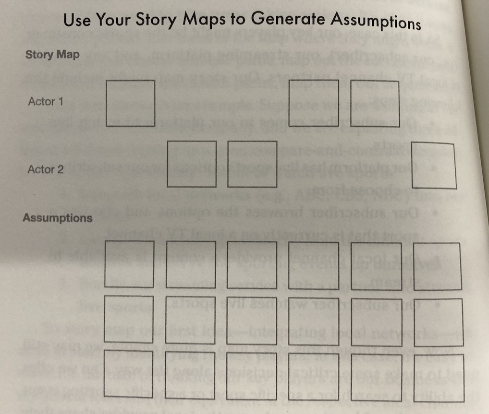
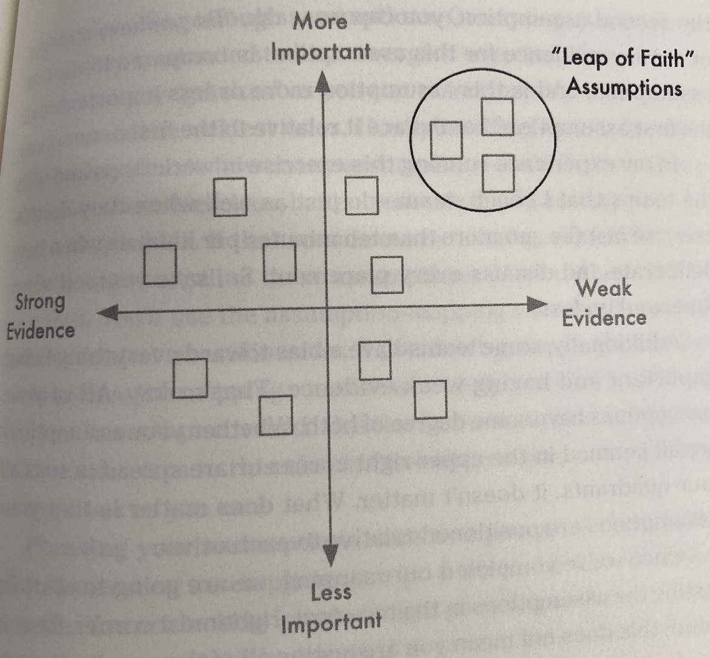

# Notes on Continuous Delivery Habits

## Ch 1
All product teams do a set of activites to decide what to build and then do a different set of activities to build and deliver it. The former is discovery, the latter is delivery.

Discovery should be a continous process. In the past business leaders just told teams what to build. Discovery happened in annual budget processes. Agile shortened delivery cycles, but business leaders still clung to dictat/discovery, teams using processes like scrum weren't able to iterate, 'usability testing' happened at the end. Now that technology supports frequent or continuous releases and better instrumentation we are able to continously measure impact, and this encourages and empowers teams to take ownership of discovery.

To do continuous discovery successfully requires six prerequiste mindsets:

	1 Outcome oriented
	2 Customer-centric
	3 Collaborative
	4 Visual
	5 Experimental
	6 Continous

**A working definition of continuous discovery:**

	At a minimum, weekly touchpoints with the customers. By the team building the product. Where they conduct small research activities. In pursuit of a defined outcome.

Note what this isn't - specialised resesearchers, big up front research, no defined outcome.

## Ch2 | A Framework for continuous discovery

Most digital teams are cross-functional. At the core are the product trio of product manager, tech lead and designer. They should start with the end in mind, the value they can create for the business. Focus on outcomes but not at the expense of the customer, avoid destructive incentives. To understand what will deliver that outcome, the team need to engage with customers. "_I've met many teams who are good at talking to customers but they forget the purpose. We aren't doing research for research's sake"_. 

'Opportunities' is a better way to frame things than 'problems to solve', not everything is a problem. Teams need to explore the opportunity space, but this is an ill-structured problem and how you frame it can affect how you might solve it. Many teams just start generating ideas. Instead they should map out the opportunity space and then decide what opportunities to pursue. 

An opportunity-solution tree can be used to visualise the hierarchy of biz outcome -> opportunities -> possible solutions. As you go down the opportunites get smaller and more team-sized. Solve project-sized opportunities by solving multiple smaller ones.

Don't ask 'should we do this or not'. Ask 'which is most important to do now'. Balance confidence with doubt. Avoid analysis paralysis by keeping the cost of decisions small and try to make them two-way doors. 

## Ch3 | Outcomes over outputs

Teams tasked with a new outcome often have no idea how to measure that outcome, how to impact it, or even if it is the right outcome to be pursuing. Lagging indicators make it hard to measure the impact of fast experiment cycles. Discovery work is needed to identify connections between product outcomes and business outcomes.

Managing by outcomes gives teams autonomy and accountability. Instead of delivering a list of features, they are asked to solve a customer problem or address a business need. This also leaves room for doubt - we don't know in advance what the right features to build are. It also tells teams how they will measure success. 

Business outcomes are often lagging indicators and can't usually be controlled directly by the team. Product outcomes are those teams are able to influence. They need to predict the outcome of lagging business outcomes. Traction metrics like enagements are just optimisations of established solutions. 

Setting a team's outcome should be a two-way negotiation between the chief of product and the teams. Stable teams should be focused on product outcomes over time. When faced with a new outcome, teams should be given a learning goal before being tasked with a performance goal. It's common to have iniital uncertainty as to how best to measure the outcome. 

Patterns to avoid:
 * Pursuing too many outcomes at once.
 * Ping-ponging from one outcome to another.
 * Setting separate discipline-based outcomes.
 * Choosing outputs as outcomes.
 * Focusing on one outcome to the detriment of others.

## Ch4 | Visualising what you know

When working with a new outcome it can be difficult to know where to start. Map out your customer's experience as it is today. You can try doing this individually to uncover different starting perspectives. Limit scope by starting with the desired outcome. This should be narrow for an optimisation outcome and broader for a more open-ended product one. Start individually to avoid groupthink. Be visual, not verbal. Draw the customer's experience, not your existing product UI. Share and ask questions. To sythesise, turn each map into nodes and links, create a map that includes all individual nodes, collapsing duplicates. 

Patterns to avoid: Getting bogged down in endless debate; using words instead of visuals; assuming your map is true, forgetting to refine and evolve as you learn more.

## Ch5 | Continous interviewing

The purpose of talking to customers is not to ask customers what you should build, but to discover and explore opportunities. Asking customers direct questions about their behaviour is likely to yield how they _think_ they behave rather than how they actually do. Ask them to share stories instead - "Tell me about the last time you bought a pair of jeans". Balance exploring customer needs and pain points with the opportunity you need to learn about.

Synthesise as you go. Make one-page interview snapshots. These include a visual reminder, a memorable quote, some context, a summary of insights and opportunities. If they suggest a feature, ask why they want it and capture the need. Draw the stories you hear.

Make interviewing a weekly habit. Have a regular slot and automate recruiting. You can do this by asking people while they are using your product in returm for some reward. Or ads. Use tools like calendly. You can recruit via customer services or sales. With a hard to reach audience, you could use a customer advisory board. The risk is that you'll end up designing for that small group. Interview as a team.

Patterns to avoid:
 * Relying on one person to recruit and interview
 * Using who what why discussion guides
 * Interviewing only when you think you need it
 * Sharing pages of notes and video rather than a summary snapshot
 * Stopping to synthesise a batch

Interview snapshot template p84.

## Ch6 | Mapping the opportunity space

Each gap between what your customers expect and how the world works represents a potential opportunity. But there can be so many it feels overwheming, you can't address all of them. Picking the ones that drive the outcome you are looking for is how we create business value. The goal should be to address the opportunities that have the biggest impact on this outcome first. To do this, start by taking an inventory of the possibilities. Drawing an opportunity solution tree helps organise them, find relationships and break them down into smaller pieces. Breaking problems into smaller pieces allows us to tackle problems that seem unsolvable and deliver value iteratively over time.

Each opportunity should be distinct. Use steps of your experience map or identify key moments in time. Capture what you understand today and revisit as your knowledge grows. 

Patterns to avoid:
 * Opportunites framed from your organisation's perspective
 * Vertical opportunities where each child has only one child
 * Opportunities with more than one parent - these are too broad
 * Opportunities which are not specific or just sentiments - e.g. 'I wish this was easy to use'
 * Opprtuninies which are solutions in disguise
 * Capturing feelings as opportunities - e.g. 'I am frustrated'

## Ch7 | Prioritising opportunities, not solutions

"You are never one feature away from success.. and you never will be".

Don't focus on shipping features, focus on addressing opportunities. Address one at a time. This limits wip and helps deliver iteratively [citation needed]. Assess and prioritise your top-level opportunities against each other. The prioritise the children of the one you choose. Get down to a leaf node, do that one first. 

Assess based on: 
 * Opportunity size  - number of customers, frequency
 * Market factors - table stakes, strategic differntiators, external trends
 * Company factors - company strategy, politics, strengths, weaknesses
 * Customer factors - user feedback, satisfaction

 Don't look for false quantitiaive precision in assessment, embrace messinness. Make the decisions two-way doors. 

 Patterns to avoid:
  * Delaying a decision until there is more data - time box
  * Over-reliance on one factor - e.g. ignoring company buy-in
  * Working backwards from your expected conclusion

## Ch8 | Supercharged ideation

For the best solutions you need diverse, original ideas. Brainstorming in groups give the illusion of productivity, but has been shown to be less good at generating ideas than individuals working alone. Sharing them with a group helps get unstuck, but then go back to generating alone. Take advantage of incubation, sleep on it. Look at analogous products. Think about corner-case users. 

Review opportunities. Generate ideas alone. Share back and discuss. Repeat until you have 15-20 ideas. 
Evaluate ideas. Dot vote. People are better at evaluating as a group. Do multiple rounds, shortlist down and revote until you get three to move forward with.

Patterns to avoid: 
 * Not including diverse perspectives
 * Generating too many variations on the same idea
 * Limiting ideation to one session
 * Selecting ideas that don't address the target opportunity (remove at dot voting)

## Ch 9 | Identifying hidden assumptions

Every product team has at some point found themselves realising they have built the wrong product. We are subject to cognitive biases like _confirmation_ and _escalation of commitment_. We need to be prepared to be wrong.

When working with a set of **ideas** we can't afford to just build them all and AB test the lot. Instead we should identify and test the **assumptions** that support those ideas. 

Types of assumption include:

* Desirability - do people want it?
* Viability - should we build it?
* Feasibilty - can we build it?
* Usability - will users understand it?
* Ethical - could it be harmful?

To identify assumptions we need to agree what an idea actually is. Story maps can help clarify this.

Other useful techniques for identifying assumptions include pre-mortems and walking back through your opportunity-solution tree to add _why_ your solution will drive the product or business outcome.

A great way to uncover ethical assumptions is to ask yourself what it would be like if a news organisation ran a story about your internal conversations that led to the creation of your product.

Prioritise assumptions by mappping them along two dimensions. Start by testing those which are most important and have the least supporting evidence.

Patterns to avoid:
 * Not generating enough assumptions
 * Phrasing your assumptions negatively - e.g. 'users won't remember their password
 * Not being specific enough - e.g. 'customers will have time'
 * Favouring one category at the expense of others - e.g. usability over desirability

## Ch 10 | Testing assumptions, not ideas

It's important to remember that we should be aiming to choose between about three different ideas. We should be testing the assumptions behind each, not validating our favourite one. But some of these ideas will share common assumptions.

Simulate the experience to see what people do, don't just ask people. Be specific about what success looks like, the proportion of users who exhibit the desired behaviour. 

Starting small and quick is a way to derisk an assumption. If after that it is still our riskiest assumption on the map, it's worth investing in a more involved test. Stop when enough risk is removed or the effort involved to test further is so great we should just build it.

Two tools that sholud be available to every team are unmoderated user testing services and one-question surveys. 

Patterns to avoid:
* Overly complex simulations
* Using percentages rather than absolute numbers, e.g. 7 out of 10
* Not defining enough evaluation criteria - e.g. acting on an email needs receive, open, click
* Designing for a sub-optimal scenario - e.g. testing with already tough audiences

